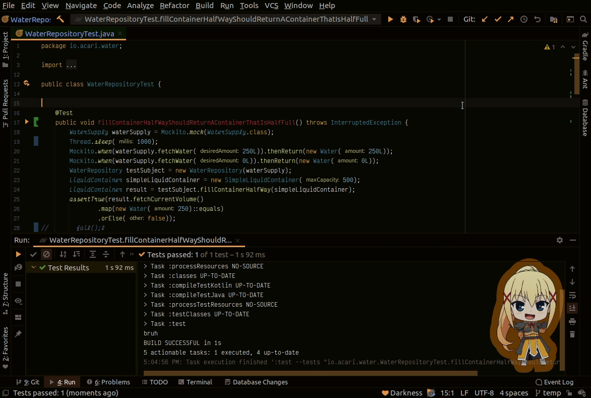

    </img>

# AMII - Rider Extension

<!-- Plugin description -->
Enables full functionality of the [Anime Meme](https://github.com/ani-memes/AMII) plugin on the Rider Platform.
Don't miss out on any of the important features supplied by AMII!
<!-- Plugin description end -->

## Installation

- Using IDE built-in plugin system:

  <kbd>Preferences</kbd> > <kbd>Plugins</kbd> > <kbd>Marketplace</kbd> > <kbd>Search for "Anime Memes - Rider Extension"</kbd> >
  <kbd>Install Plugin</kbd>

- Manually:

  Download the [latest release](https://github.com/ani-memes/amii-rider-extension/releases/latest) and install it manually using
  <kbd>Preferences</kbd> > <kbd>Plugins</kbd> > <kbd>⚙️</kbd> > <kbd>Install plugin from disk...</kbd>

---

# Documentation

- [Features](#features)
  - [Test Result Interactions](#test-result-interactions)

[comment]: <> (  - [Build Task Interations]&#40;#build-tasks&#41;)

- [Extras](#extras)
  - [The Doki Theme](#the-doki-theme)
  - [Waifu Motivator](#the-doki-theme)
  - [Release Channel](#want-amii-updates-sooner)
- [Attributions](#attributions)
---
# Features

This isn't a comprehensive list of all the current functionality that AMII has to offer.
Just the features that cannot be provided by the generic platform agnostic plugin.

To see a full list of features, [please see AMII's documentation](https://github.com/ani-memes/AMII#documentation).

Without this extension you'll be missing out on:

### Test Result Interactions

Tests pass and tests fail, that's just a fact of life.
You know what's better than red x's and green check marks?

> Anime Memes

**Test Pass**

**Test Failures**

[comment]: <> (### Build Tasks Interactions)

[comment]: <> (This is an IDE, right? Well, that means you can build code right from your editor.)

[comment]: <> (It just so happens, that builds happen to fail from time to time.)

[comment]: <> (You did put in that semicolon, right?)

[comment]: <> (![Build Failures]&#40;./readmeAssets/build.gif&#41;)

[comment]: <> (Well MIKU knows when your builds fail too, so expect a response as well.)

[comment]: <> (**Build Pass**)

[comment]: <> (When you get your marbles all back,)

[comment]: <> (the next time you build successfully &#40;after a build failure&#41; MIKU will give you a pat on the back.)

---

# Extras!

    </img>

## The Doki Theme

Do you need more anime waifus in your life?
Well I have a solution just for that problem, [The Doki Theme](https://github.com/doki-theme)!
Decorate all your favorite tools with your favorite character(s)!

Available for any [JetBrains IDE](https://github.com/doki-theme/doki-theme-jetbrains).

## Waifu Motivator

A collection of open-sourced Jetbrains IDE plugins that bring <i>Waifus</i> in to help keep your motivation to complete during your coding challenges.

Available for any [JetBrains IDE](https://github.com/waifu-motivator/waifu-motivator-plugin).

## Want AMII updates sooner?

I have a [canary release channel](https://github.com/Unthrottled/jetbrains-plugin-repository) that you can set up to get the latest and greatest!

---

# Attributions

Plugin based on the [IntelliJ Platform Plugin Template](https://github.com/JetBrains/intellij-platform-plugin-template)
