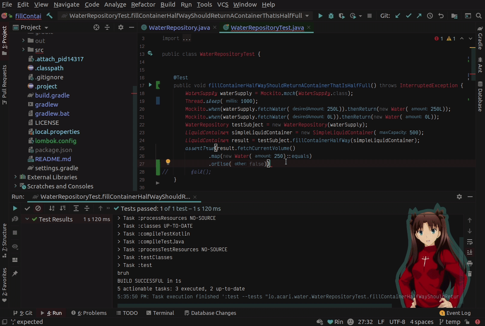

    </img>

# AMII - Rider Extension

<!-- Plugin description -->
Enables full functionality of the "Anime Meme" plugin on the Rider Platform.
Don't miss out on any of the important features supplied by AMII!
<!-- Plugin description end -->

## Installation

- Using IDE built-in plugin system:

  <kbd>Preferences</kbd> > <kbd>Plugins</kbd> > <kbd>Marketplace</kbd> > <kbd>Search for "Anime Memes - Rider Extension"</kbd> >
  <kbd>Install Plugin</kbd>

- Manually:

  Download the [latest release](https://github.com/ani-memes/amii-rider-extension/releases/latest) and install it manually using
  <kbd>Preferences</kbd> > <kbd>Plugins</kbd> > <kbd>⚙️</kbd> > <kbd>Install plugin from disk...</kbd>

---

# Documentation

- [Features](#features)
  - [Interactions](#interactions)
    - [Test Results](#test-results)
    - [Build Tasks](#build-tasks)
- [Extras](#extras)
  - [The Doki Theme](#the-doki-theme)
  - [Waifu Motivator](#the-doki-theme)
  - [Release Channel](#want-amii-updates-sooner)
- [Attributions](#attributions)
---
# Features

Here is a comprehensive list of all the current functionality that AMII has to offer.

## Interactions

This is the proverbial meat and potatoes of the plugin.
You will have choicest of anime memes delivered right to your IDE as you program to your heart's content.

**MIKU**

As mention previously, our Meme Inference Knowledge Unit (or MIKU for short)
has the ability interact with you as you build code.
MIKU's preferred method of communication is Anime Memes.

If you are wondering what things you can do to cause MIKU give you memes, well just look below!

_All events are configurable to be enabled/disabled, see [configuration](#configuration) for more details_

### Test Results

Tests pass and tests fail, that's just a fact of life.
You know what's better than red x's and green check marks?

> Anime Memes

**Test Pass**

**Test Failures**

### Build Tasks

This is an IDE, right? Well, that means you can build code right from your editor.
It just so happens, that builds happen to fail from time to time.
You did put in that semicolon, right?

Well MIKU knows when your builds fail too, so expect a response as well.

**Build Pass**

When you get your marbles all back,
the next time you build successfully (after a build failure) MIKU will give you a pat on the back.

---

# Extras!

    </img>

## The Doki Theme

Do you need more anime waifus in your life?
Well I have a solution just for that problem, [The Doki Theme](https://github.com/doki-theme)!
Decorate all your favorite tools with your favorite character(s)!

Available for any [JetBrains IDE](https://github.com/doki-theme/doki-theme-jetbrains).

## Waifu Motivator

A collection of open-sourced Jetbrains IDE plugins that bring <i>Waifus</i> in to help keep your motivation to complete during your coding challenges.

Available for any [JetBrains IDE](https://github.com/waifu-motivator/waifu-motivator-plugin).

## Want AMII updates sooner?

I have a [canary release channel](https://github.com/Unthrottled/jetbrains-plugin-repository) that you can set up to get the latest and greatest!

---

# Attributions

Plugin based on the [IntelliJ Platform Plugin Template](https://github.com/JetBrains/intellij-platform-plugin-template)
